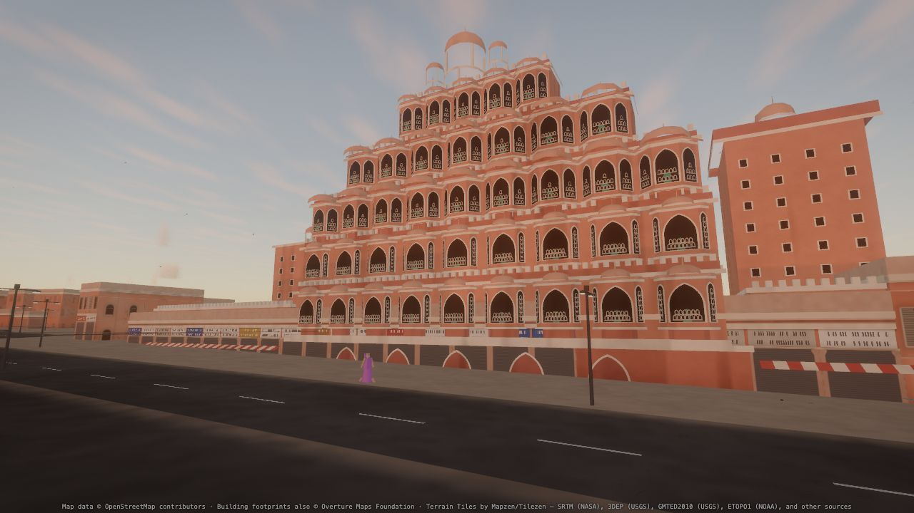
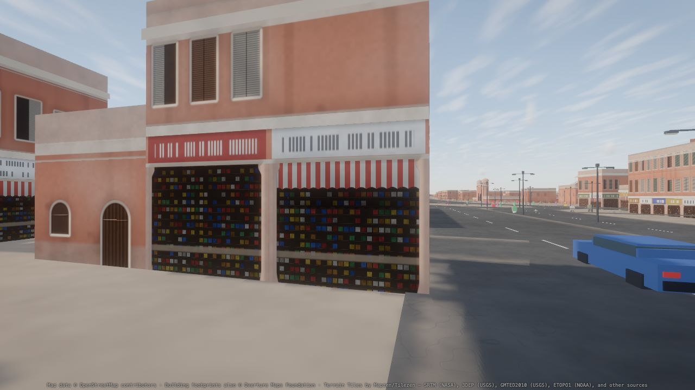
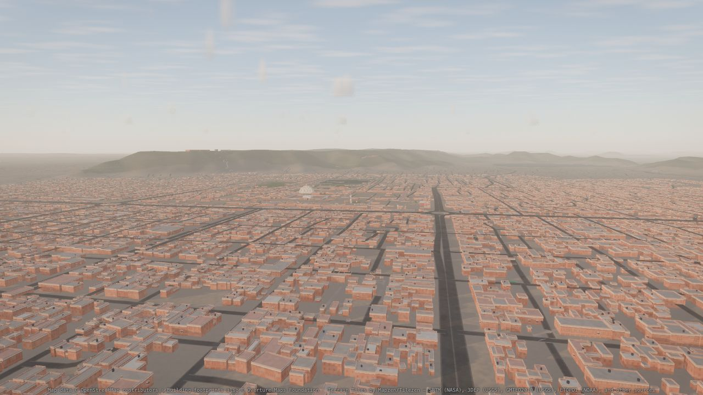
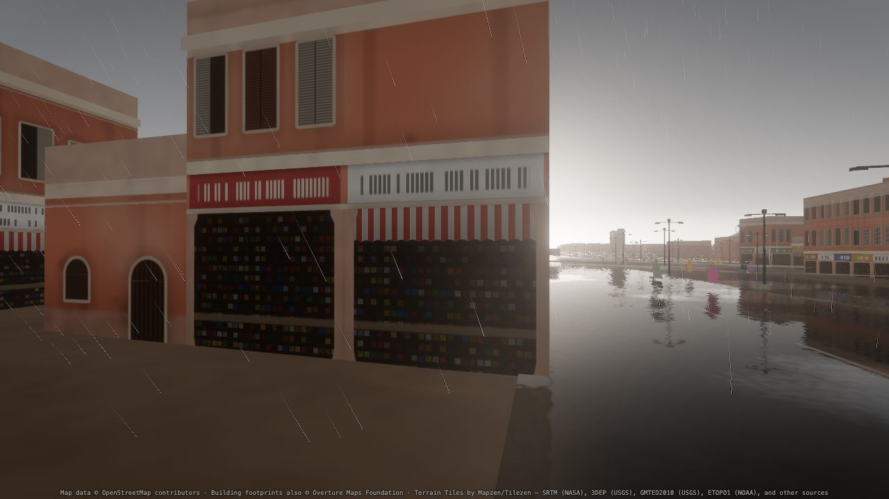
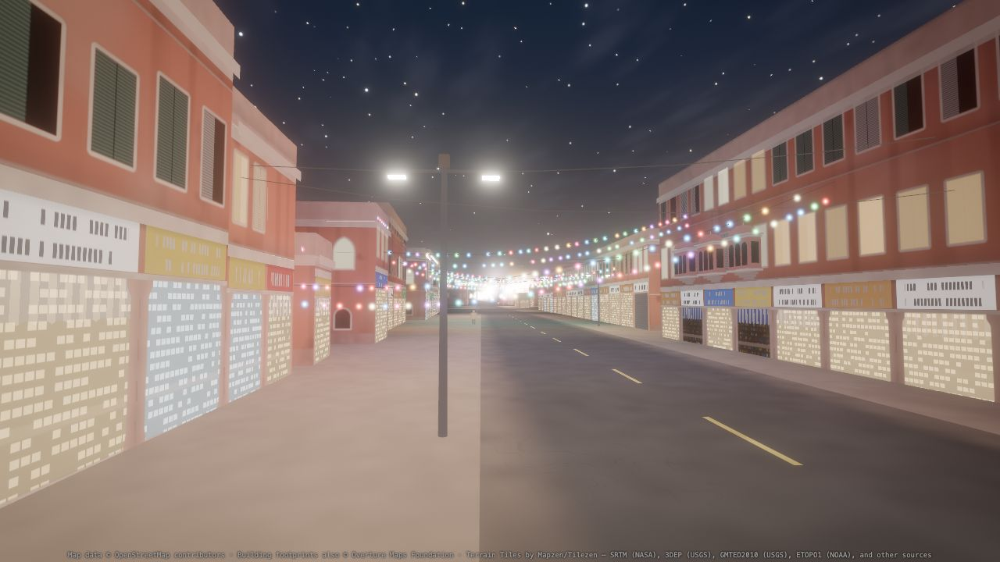
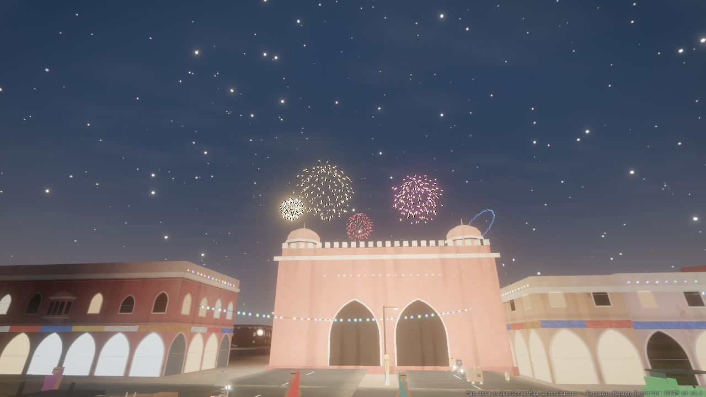
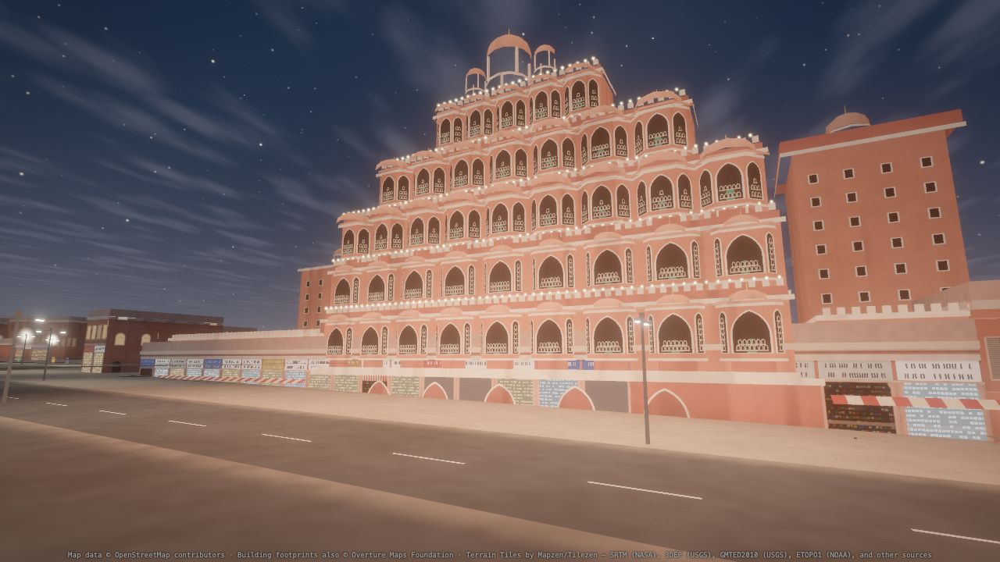
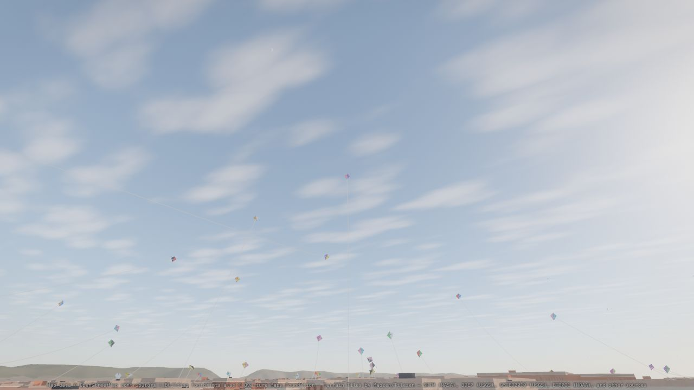

# Jaipur 3D

Real-time 3D Jaipur in the browser: the Walled City and its bazaars, Hawa Mahal, Jantar Mantar, Jal Mahal, the City Palace, the gates and the Aravalli forts, with time of day, weather, street life, a Diwali night, a Makar Sankranti sky full of kites, procedural sound, a cinematic tour and free-fly (keyboard, mouse and touch). Static site: Vite + three.js (WebGL2), no server.

Built with Claude Code from OpenStreetMap data, Overture Maps building footprints and real terrain. It is a **stylised, honest model, not a photographic one** (see [Limitations](#limitations-and-what-was-not-verified)).

| | |
|---|---|
|  |  |
| Hawa Mahal at sunrise (its street facade faces east) | Walled City street at noon: the old city's buildings are pink by law |
|  |  |
| Golden hour, aerial | Monsoon dusk: rain, wet-street reflections |
|  |  |
| Diwali, 8 Nov 2026 (a moonless night): strings, floodlit gate | Fireworks over the bazaars |
|  |  |
| Hawa Mahal at night | Makar Sankranti: kites from a flyer's rooftop |
|  | |
| Loo dust storm | |

All images are produced by `npm run shots` (fixed seeds; see [Verification](#verification)).

## Run

```bash
npm install
npm run dev          # http://127.0.0.1:5173
npm run build        # -> dist/  (static; Vercel builds this on every push to main)
npm test             # 126 unit tests (node --test)
```

The baked data is committed (`public/data`, 11.8 MB). To rebuild it from the sources: `npm run bake:terrain`, `npm run fetch:osm` (Overpass, ~25 min, cached in git-ignored `data-raw/`), `python3 -m pip install duckdb` once and `npm run fetch:overture` (about 3 minutes: the two Overture GeoParquet files that overlap the Walled City, read through DuckDB), then `npm run bake:osm`. Without `data-raw/overture/` the bake stays OSM-only and says so.

### Controls

| | Desktop | Touch |
|---|---|---|
| Move | `W A S D` / arrows | left third of the screen: virtual stick |
| Up / down | `E` or `Space` / `Q` or `C` | `▲` `▼` buttons |
| Look | drag | drag anywhere else |
| Speed | `Shift` fast, `Ctrl` slow, wheel | |
| Modes | `T` tour, `F` fly, `G` walk (eye height 1.7 m), `N` next tour shot | Camera panel |
| Weather | `1`-`5` clear / haze / loo / monsoon / winter | Weather panel |
| Time | `[` `]` ±30 min, Time panel (slider, 1x to 3600x, date presets) | Time panel |
| Sound | `M` mute (sound starts after your first tap or key) | Sound panel |
| Other | `P` stats overlay, `H` help | Quality panel (Low / Medium / High reloads) |

The dock at the bottom has Camera, Time, Weather, Traffic, Festival (Diwali / Sankranti, kites), Sound and Quality. The app opens with a five-shot tour (sunrise over Hawa Mahal, Johari Bazaar, Diwali night, monsoon dusk, Jal Mahal to Amer Fort at golden hour); any movement input hands over to free-fly.

URL parameters: `?tier=low|medium|high`, `?t=<hour>`, `?weather=clear|dust|loo|monsoon|winter`, `?festival=diwali|sankranti`, `?tour=0` (skip the tour), `?perf=1`. Profiling only: `?off=shadow,bloom,clouds,refl,life,festival`, `?msaa=`, `?pr=`, `?fps=0`.

## How it works

```
Overpass (OSM)  ──fetch:osm──▶ data-raw/osm/*.json (git-ignored)
Overture Maps   ─fetch:overture─▶ data-raw/overture/buildings.jsonl (git-ignored): only footprints that are NOT OSM buildings
Terrarium tiles ─bake:terrain─▶ public/data/terrain/   (16-bit heights, near 16 km @ 15.6 m, far 72 km @ 141 m)
                                        │
                     bake:osm (scripts/lib/osm-bake-lib.mjs, overture-merge.mjs) ─▶ public/data/osm/
                       manifest.json  landmarks, sites, gates, walled-city box, land-cover meta, counts, height sources
                       b_* / r_* / m_* 500 m tiles: buildings, roads, misc (decimetre ints, chunked by tile)
                       graph.json      street graph (16,047 nodes / 21,639 edges)   cover.dat  10 m land-cover raster
                                        │
   browser ── App (src/app.js): one SimClock (real UTC instant, IST) drives sky, weather, traffic, festival, audio
     render   sky LUT + volumetric clouds + IBL, CSM shadows, clipmap terrain, HDR post (bloom, AgX), planar wet-street reflection
     world    tile worker builds extruded OSM buildings in real metres + roads; landmark models placed from OSM positions
     sim      traffic / people / cows / pigeons (IDM, fixed 1/30 s step, Web Worker, instanced)
     festival light grid, lamps, strings, diyas, fireworks, kites (worker plans the layout from the graph + footprints)
     audio    procedural Web Audio, spatialised to the camera
     camera   free-fly / walk / tour, compact UI
```

- **Data**: streets, footprints, building tags, landmark positions and the land cover come from OpenStreetMap through Overpass; terrain from the baked Terrarium tiles. OSM maps only strips of the Walled City's buildings, so the **45,185 footprints Overture Maps has for the core zone that OSM does not** (48,290 rows, 45,308 Google Open Buildings and 2,982 Microsoft ML, release 2026-09-23.1, before de-duplication) are merged in: each is dropped if it lies on an OSM footprint, on a street or touches a street's centreline, and the rest are drawn as plain massings (flag `o` in the chunks). Heights follow `height` tag > `building:levels` x 3.3 m > inference from neighbours (**99.8 % of the 54,919 buildings are inferred**: none of the 48,290 Overture rows has a height, floor count, class or roof shape). If a fetch fails the pipeline stops and names the host: nothing is invented or filled in.
- **Landmarks** are placed from OSM (Hawa Mahal is a node: its facade is put on the east edge of the enclosing block; Jantar Mantar, Jal Mahal, Chandra Mahal, Mubarak Mahal and the gates use their real outlines); facts and conflicts between sources are in [docs/LANDMARK_FACTS.md](docs/LANDMARK_FACTS.md).
- **Simulation** uses fixed timesteps with clamped frame deltas and one clock; everything that moves with time (light, weather, traffic, festival, sound) reads it.
- **Diwali** (Sunday 8 Nov 2026) is moonless by the astronomy module (new moon 9 Nov 07:02 UTC); Makar Sankranti is 14 Jan 2027. The sun and moon are computed for the real place and instant (tested).

## Quality tiers and budgets

`src/core/budgets.js` is the single source of truth; `npm run check:budgets` drives each tier to its worst views (dense street, high drone, landmark close-up, monsoon, dust storm, night lamps, Diwali, kites) and enforces the GPU-independent numbers below.

| Tier | Target | Draw calls | Triangles | Texture MB | Geometries | Instances | Worst measured |
|---|---|---|---|---|---|---|---|
| High | 60 fps | 700 | 5.5 M | 320 | 400 | 30,000 | 313 / 5.20 M / 216 / 348 / 27,727 |
| Medium | 60 fps | 480 | 3.2 M | 192 | 300 | 15,000 | 215 / 2.55 M / 144 / 232 / 14,827 |
| Low (phones) | steady 30 fps | 260 | 1.0 M | 96 | 220 | 6,000 | 109 / 0.82 M / 34 / 130 / 5,508 |

The 46k Overture footprints fit those budgets because of how they are drawn, not because a budget was raised: they are plain (no facade instances, no rooftop mumty, cornice only on street-facing walls), they exist only inside a per-tier radius (`overtureRadius`: 900 m Low, 800 m Medium, 1,200 m High), the Low tier draws them as bare extrusions (`overturePlain`), oriel instances no longer cast shadows or appear in the wet-street mirror and have a leaner mesh (243 -> 133 triangles), and the Medium oriel pool is 2,100 instead of 2,700.

Detection picks the tier from the GPU string, device class and memory; `?tier=` and the Quality panel override it. Dynamic resolution holds the frame-time target (a capped 30 fps phone probes back up after holding the cap), MSAA follows the pixel ratio (4x, 2x, or FXAA above about 1.9x).

**Measured on the development Mac (Apple M4 Pro, Chrome, ANGLE/Metal, 1600 x 900 at 2x)**: High holds a locked 60 fps on the four benchmark views (three at pixel ratio 2, the drone at 1.76); uncapped it runs 55-77 fps (12.9-18.6 ms), with run-to-run noise of a few ms. A/B costs at pixel ratio 1.76: 4x MSAA +2.7 to +6.7 ms over none, 2x +1.5 to +3 ms, shadows about 1 ms, bloom about 0.8 ms, street life and festival about 0. Medium runs 83-114 fps uncapped. Low at a phone-sized 390 x 844 @ 3x renders in about 2 ms on this GPU and is locked at 30 fps as shipped; its main-thread cost is about 3.6 ms per frame with the CPU throttled 6x. **Phones and mid-range GPUs have not been measured** (no device available).

## Verification

| Command | What it proves |
|---|---|
| `npm test` | 126 unit tests: OSM bake and real-data shapes, Overture merge (conversion, de-duplication, street rejection, determinism, real baked chunks), landmark plan, geometry heights, IDM traffic, weather, astronomy (incl. moonless Diwali), light grid, kites, fireworks, festival layout on real facades, audio mixing model, camera maths, dynamic resolution |
| `npm run check:data` | baked data 11.8 MB, under the 30 MB budget, no chunk above 4 MB |
| `npm run check:budgets` | per-tier draw calls / triangles / texture MB / geometries / instances in the worst views |
| `npm run check:audio` | in real Chrome: no sound before a gesture, weather / time / altitude change the measured spectrum, panning direction, boom and thunder delays (distance / 343 m/s), mute (18 checks) |
| `npm run check:ui` | in real Chrome incl. a touch phone via CDP: keys, mouse, terrain clamp, walk height, every panel, all five tour shots (date, weather, festival, sun altitude), touch stick / look / up button, 44 px targets, no overflow, visible attribution (45 checks) |
| `npm run shots` | fixed-seed matrix: 7 times of day x 3 views, 4 weather presets x 2 times x 2 views, Diwali and Sankranti, plus a subset on Medium and Low: every image checked (not black, flat or blown out) and two renders of one state differ by 0.000 / 255; writes `shots-tmp/matrix/index.html` |
| `grep -l "Test Bazaar" dist/assets/*` | prints nothing: synthetic test geometry never reaches the production bundle |

## Data provenance: what is real and what is art direction

**Real** (OpenStreetMap, ODbL): street network, building footprints and tags, landmark positions and outlines, land cover, gates and wall fragments. **Real** (Overture Maps, ODbL; Google Open Buildings and Microsoft ML footprints traced from satellite imagery): 45,185 additional footprints in the core zone. Their outlines are machine-traced, so lanes and courtyards are sometimes merged or missing. **Real** (Terrarium): terrain heights. **Computed for the real place and date**: sun, moon and stars.

**Approximate / art direction (not survey data)**: building heights (99.8 % inferred); **street-lamp positions** (OSM has no lamp nodes here: lamps are generated along the real roads at a nominal spacing); which bazaars carry festival strings, bulb colours and spacing, diyas, landmark floodlights; kite size, aerodynamics and the 7 m/s winter wind (chosen so kites fly); all sounds (synthesised, nothing recorded); the Walled City box (OSM has no boundary object; the brief's bounds are used, for the pink palette); landmark proportions of Chandra Mahal, Mubarak Mahal and the gatehouses; the tour's paths and timings.

## Licensing and attribution

- **Map data © [OpenStreetMap contributors](https://www.openstreetmap.org/copyright)**, available under the [Open Database Licence (ODbL)](https://opendatacommons.org/licenses/odbl/). The baked chunks in `public/data/osm/` are a derived database of it and stay under the ODbL; the rendered pictures and the app are produced works that need the credit, which is shown in the app footer and the help sheet. Data © OpenStreetMap contributors was fetched through the Overpass API on 2026-09-29.
- **Building footprints © [Overture Maps Foundation](https://docs.overturemaps.org/attribution/)**, buildings theme, [ODbL 1.0](https://opendatacommons.org/licenses/odbl/); its sources here are Google Open Buildings (CC BY 4.0) and Microsoft Global ML Building Footprints (ODbL). Release 2026-09-23.1, fetched on 2026-09-29 (UTC) for the core zone only. The baked chunks are a derived database and stay under the ODbL (share-alike), together with the OSM data they merge with.
- **Terrain Tiles by Mapzen/Tilezen — SRTM (NASA), 3DEP (USGS), GMTED2010 (USGS), ETOPO1 (NOAA), and other sources** (Terrarium tiles on AWS Open Data, https://registry.opendata.aws/terrain-tiles/).
- three.js is MIT-licensed.
- **No licence has been chosen yet for this repository's own code**: until the owner adds one, all rights are reserved by default. This is an open decision.

## Limitations and what was not verified

- **Not photographic.** An independent reviewer scored the screenshots at roughly 20-25 % of the way to photographs, and a second, photo-based review (16 real CC-licensed photographs of Jaipur, credits in [docs/REFERENCE_PHOTOS.md](docs/REFERENCE_PHOTOS.md)) scored Hawa Mahal, bazaar streets, night lighting, colour, Jal Mahal and Jantar Mantar 2 / 5, Amer and street life 1 / 5: strong sky, weather and festival lighting; weak architecture (blocky, repeated facades, none of the carved detail), simple people / animals / vehicles, sparse street life and clutter, smooth hills. The photo review's cheap fixes (terracotta hue, white LED lamps, darker night sky, warm strip lights on the parapets, Hawa Mahal tier profile) are in; the rest is listed in [PROGRESS.md](PROGRESS.md).
- **The bazaar blocks are now filled with real Overture footprints, but as plain boxes with a painted frontage**: heights are inferred (about three storeys everywhere), roofs are flat, the ML-traced outlines are approximate. Road-facing shop walls have pillars, white signboards, awnings, a chhajja and louvre-shuttered windows drawn in the shader (they do not project or cast shadows), overhead wires are generated across streets that have facades on both sides, and the lamps have two arms; there are no railings, jaali screens or corner chhatri towers yet (see [PROGRESS.md](PROGRESS.md)). Overture footprints exist only within a per-tier radius of the camera; beyond it the city is OSM-only as before. Nothing is invented: every filler building is a real footprint.
- Hawa Mahal is modelled from photographs as five rows of projecting oriel bays (9 / 9 / 9 / 7 / 5, counted by eye) with cupolas, white-framed pointed openings and exactly 953 small lattice cells (the count is a documented figure), flanked by two arcaded wings with striped awnings, a plain tall block and a tower with a chhatri; the white stucco filigree, the roofline pinnacles and the exact proportions are approximate, so it is a recognisable model, not a photographic facade; forts are simple masses on smooth SRTM hills; no building collision (only terrain) in free-fly.
- Not verified: performance on phones or mid-range GPUs (only headroom on the M4 Pro and a 6x CPU throttle), the sound on real speakers by a person (the audio checks are measurements), any scene that has no photographic reference (kites, a Diwali market, a monsoon street: none could be found), colours (read off the photographs by eye, not sampled), and any browser other than Chrome.
- WebGPU is not used (WebGL2 only). Sound needs a user gesture (browser rule); the synthesised call to prayer was deliberately not made.

## Credits

OpenStreetMap contributors; Overture Maps Foundation (Google Open Buildings, Microsoft ML Building Footprints); Mapzen / Tilezen and the data providers above; three.js. Built with Claude Code.
